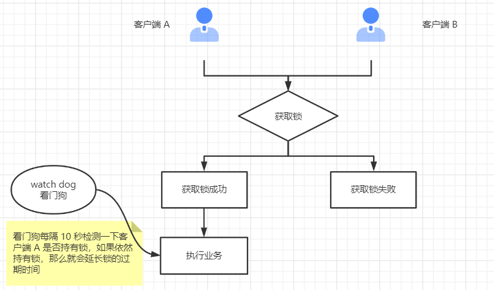

[//]:# "2023/4/21 10:47|Redis"

# Redis 分布式锁

> 文章转载自：[cnblog](https://www.cnblogs.com/wugongzi/p/16827473.html)

## 介绍

学习过 Java 的同学，应该对锁都不陌生。Java 中多个线程访问共享资源时，会出现并发问题，我们通常利用 synchronized 或者 Lock 锁来解决多线程并发访问从而出现的安全问题。细心的同学可能已经发现了， synchronized 或者 Lock 锁解决线程安全问题在单节点情况下是可行的，但是如果服务部署在多台服务器上，本地锁就失效了。

分布式场景下，需要采用新的解决方案，就是今天要说的 Redis 分布式锁。日常业务中，类似抢红包，秒杀等场景都可以使用 Redis 分布式锁来解决并发问题。

## 特点

分布式在保障安全、高可用的情况下需要具备以下特性

- 互斥性：任意一个时刻，只能有一个客户端获取到锁
- 安全性：锁只能被持久的客户端删除，不能被其他人删除
- 高可用，高性能：加锁和解锁消耗的性能少，时间短
- 锁超时：当客户端获取锁后出现故障，没有立即释放锁，该锁要能够在一定时间内释放，否则其他客户端无法获取到锁
- 可重入性：客户端获取到锁后，在持久锁期间可以再次获取到该锁

## 解决方案

### 1. SETNX

Redis 提供了一个获取分布式锁的命令 **SETNX**，如果获取锁成功，redis 返回 1，获取锁失败 redis 返回 0。

这个命令看似可以达到我们的目的，但是不符合分布式锁的特性，如果客户端在执行业务逻辑过程中，服务器宕机了，finally 中代码还没来得及执行，锁没有释放，也就意味其他客户端永远无法获取到这个锁。

### 2. SETNX + EXPIRE

该方案获取锁之后，立即给锁加上一个过期时间，这样即使客户端没有手动释放锁，锁到期后也会自动释放。

我们来看下伪代码：

```
if (setnx(k1, v1) == 1){
    expire(key, 10);
    try {
       //.... 你的业务逻辑
    } finally {
        del(key);
    }
}
```

这个方案很完美，既可以获取到，又不用担心客户端宕机。等等，这里面真的没有问题吗？再仔细瞅瞅，一瞅就瞅出问题来了。

```
if (setnx(k1, v1) == 1){
    // 再刚获取锁之后，想要给锁设置过期时间，此时服务器挂了
    expire(key, 10); // 这条命令没有执行
    try {
       //.... 你的业务逻辑
    } finally {
        del(key);
    }
}
```

这里的 setnx 命令和 expire 命令不是原子性的，他们之间执行需要一定的等等时间，虽然这个时间很短，但是依然有极小概率出现问题。

### 3. Lua脚本

既然 setnx 和 expire 两个命令非原子性，那么我们让其符合原子性即可，通过 Lua 脚本即可实现。Redis 使用单个 Lua 解释器去运行所有脚本，并且， Redis 也保证脚本会以原子性(atomic)的方式执行： 当某个脚本正在运行的时候，不会有其他脚本或 Redis 命令被执行。

具体实现如下：

```
if redis.call('setnx',KEYS[1],ARGV[1]) == 1 then
   redis.call('expire',KEYS[1],ARGV[2])
else
   return 0
end;
```

这样应该没问题了吧，看似上面的几个问题都很好解决了。不对，再想想，肯定还有没考虑到的。

我们再来看一段伪代码：

```
// 执行 lua 脚本
// 获取 k1 锁，过期时间 10 s
if (execLua()==1){
    try {
        buyGoods();
    } finally {
        del(key);
    }
}
```


从图中我们可以很清晰发现问题所在：

1. 客户端 A 还未执行完毕，客户端 B 就获取到了锁，这样就可能导致并发问题
2. 客户端 A 执行完毕，开始删除锁。但此时的锁为 B 所有，相当于删除了属于客户端 B 的锁，这样肯定会发生问题

### 4. SETNX + 检验唯一随机值

既然锁有可能被别的客户端删除，那么在删除锁的时候我们加上一层校验，判断释放锁是当前客户端持有的，如果是当前客户端，则允许删除，否则不允许删除。

使用示例：

```java
if（jedis.set(resource_name, random_value, "NX", "EX", 100s) == 1）{ //加锁, value 传入一个随机数
    try {
        do something  //业务处理
    }catch(){
　　}
　　finally {
       // 判断 value 是否相等, 相等才释放锁, 这里判断和删除是非原子性, 真实场景下可以将这两步放入 Lua 脚本中执行
       if (random_value.equals(jedis.get(resource_name))) {
        	jedis.del(lockKey); //释放锁
        }
    }
}
```

Lua 脚本如下：

```bash
if redis.call("get",KEYS[1]) == ARGV[1] then
    return redis.call("del",KEYS[1])
else
    return 0
end
```

此方案解决了锁被其他客户端解除的问题，但是依然没有解决锁过期释放，但是业务还没有执行完成的问题。

### 5. Redisson 框架

方案4中并没有解决方法未执行完成，锁就超时释放的问题。这里有个方案大家比较容易想到，那就是锁的超时时间设置长一点，比如2min，一个接口执行时间总不能比 2 min 还长，那你就等着领盒饭吧，哈哈哈。但是这么做，一来是不能每个锁都设置这么久超时时间，二来是如果接口出现异常了，锁只能 2 min 后才能释放，其他客户端等待时间较长。

这个问题早就有人想到了，并给出了解决方案，开源框架 Redisson 解决了这个问题。



Redisson 在方法执行期间，会不断的检测锁是否到期，如果发现锁快要到期，但是方法还没有执行完成，便会延长锁的过期时间，从而解决了锁超时释放问题。

### 6. Redlock

上面所介绍的分布式锁，都是在单台 Redis 服务器下的解决方案。真实的生产环境中，我们通常会部署多台 Redis 服务器，也就是集群模式，这种情况上述解决方案就失效了。

对于集群 Redis，Redis 的作者 antirez 提出了另一种解决方案，Redlock 算法

Redlock 算法大致流程如下：


1. 获取当前Unix时间，以毫秒为单位。

2. 依次尝试从N个实例，使用相同的key和随机值获取锁。在步骤2，当向Redis设置锁时,客户端应该设置一个网络连接和响应超时时间，这个超时时间应该小于锁的失效时间。例如你的锁自动失效时间为10秒，则超时时间应该在5-50毫秒之间。这样可以避免服务器端Redis已经挂掉的情况下，客户端还在死死地等待响应结果。如果服务器端没有在规定时间内响应，客户端应该尽快尝试另外一个Redis实例。

3. 客户端使用当前时间减去开始获取锁时间（步骤1记录的时间）就得到获取锁使用的时间。当且仅当从大多数（这里是3个节点）的Redis节点都取到锁，并且使用的时间小于锁失效时间时，锁才算获取成功。

4. 如果取到了锁，key的真正有效时间等于有效时间减去获取锁所使用的时间（步骤3计算的结果）。

5. 如果因为某些原因，获取锁失败（没有在至少N/2+1个Redis实例取到锁或者取锁时间已经超过了有效时间），客户端应该在所有的Redis实例上进行解锁（即便某些Redis实例根本就没有加锁成功）。

**总结：** 简单总结一下就是客户端向 Redis 集群中所有服务器发送获取锁的请求，只有半数以上的锁获取成功后，才代表锁获取成功，否则锁获取失败。

